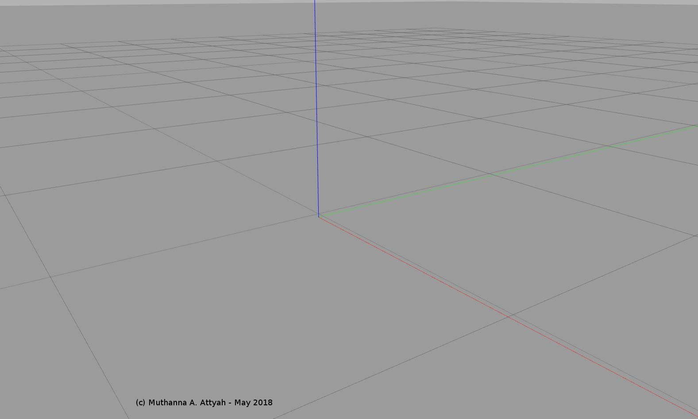

# RoboND_Robot_Localization_Project
ROS Robot Localization Using AMCL ROS Package


## Installation of Some Required ROS packages:

Install the following packages if it is not yet installed:

```bash
$ sudo apt-get install ros-kinetic-navigation
$ sudo apt-get install ros-kinetic-map-server
$ sudo apt-get install ros-kinetic-move-base
$ rospack profile
$ sudo apt-get install ros-kinetic-amcl
```

## Creating Package:

Create new empty package:

```bash
$ cd ~/catkin_ws/src/
$ catkin_create_pkg udacity_bot
```

Create folders, **launch** and **worlds**, that will further define the structure of your package:

```bash
$ cd udacity_bot
$ mkdir launch
$ mkdir worlds
```

 create a simple world, with no objects or models that will be launched later in Gazebo
 
 ```bash
$ cd worlds
$ nano udacity.world
```

```xml
<?xml version="1.0" ?>

<sdf version="1.4">

  <world name="default">

    <include>
      <uri>model://ground_plane</uri>
    </include>

    <!-- Light source -->
    <include>
      <uri>model://sun</uri>
    </include>

    <!-- World camera -->
    <gui fullscreen='0'>
      <camera name='world_camera'>
        <pose>4.927360 -4.376610 3.740080 0.000000 0.275643 2.356190</pose>
        <view_controller>orbit</view_controller>
      </camera>
    </gui>

  </world>
</sdf>
```

create a launch file:

```bash
$ cd ..
$ cd launch
$ nano udacity_world.launch
```

```xml
<?xml version="1.0" encoding="UTF-8"?>

<launch>

  <arg name="world" default="empty"/> 
  <arg name="paused" default="false"/>
  <arg name="use_sim_time" default="true"/>
  <arg name="gui" default="true"/>
  <arg name="headless" default="false"/>
  <arg name="debug" default="false"/>

  <include file="$(find gazebo_ros)/launch/empty_world.launch">
    <arg name="world_name" value="$(find udacity_bot)/worlds/udacity.world"/>
    <arg name="paused" value="$(arg paused)"/>
    <arg name="use_sim_time" value="$(arg use_sim_time)"/>
    <arg name="gui" value="$(arg gui)"/>
    <arg name="headless" value="$(arg headless)"/>
    <arg name="debug" value="$(arg debug)"/>
  </include>

</launch>
```

Launch it!

```bash
$ cd ~/catkin_ws/
$ catkin_make
$ source devel/setup.bash
$ roslaunch udacity_bot udacity_world.launch
```

<p align="center">  </p>

