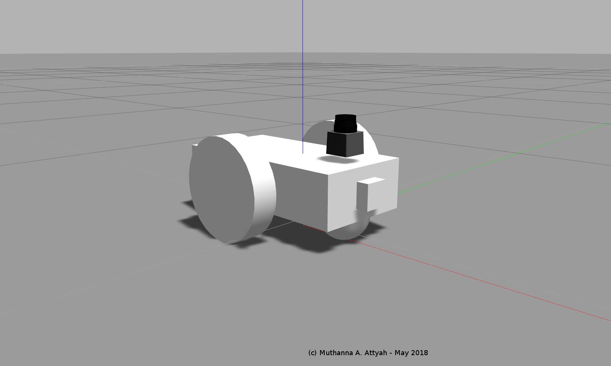
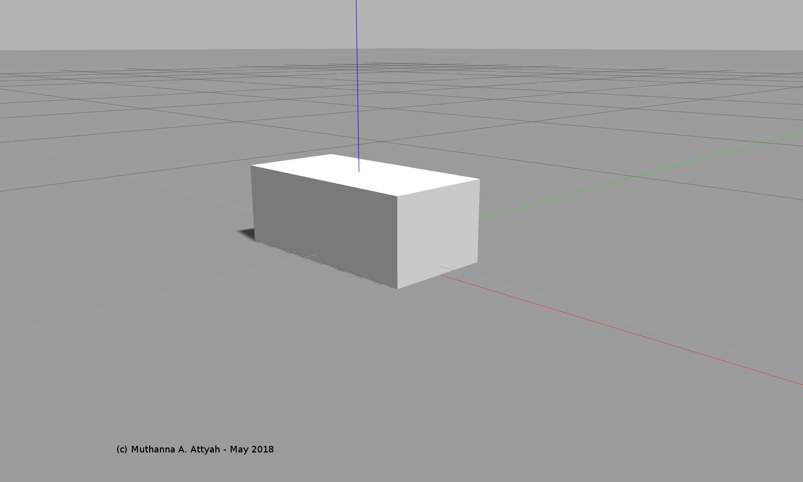

# RoboND Robot Localization Project
## using AMCL ROS Package
## (c) Muthanna A. Attyah 
## May 2018


## Repository installation steps:

* Clone from git repository
```bash
$ cd ~
$ git clone https://github.com/mkhuthir/RoboND_Robot_Localization_Project.git catkin_ws
```

* Install the following packages if it is not yet installed:

```bash
$ sudo apt-get install ros-kinetic-navigation
$ sudo apt-get install ros-kinetic-map-server
$ sudo apt-get install ros-kinetic-move-base
$ rospack profile
$ sudo apt-get install ros-kinetic-amcl
```

* Compile code using `catkin_make` and source it.

```bash
$ cd catkin_ws
$ catkin_make
$ source ~/catkin_ws/devel/setup.bash
```

## Launching Packages

<p align="center">  </p>
<p align="center">  </p>
<p align="center">  </p>
<p align="center">  </p>
<p align="center">  </p>
<p align="center">  </p>

[](http://www.youtube.com/watch?v=lxxqGsvKArw)


<p align="center">  </p>
<p align="center">  </p>
<p align="center">  </p>
<p align="center">  </p>
<p align="center">  </p>
<p align="center">  </p>

[](http://www.youtube.com/watch?v=ODnIm-24Zgw)
