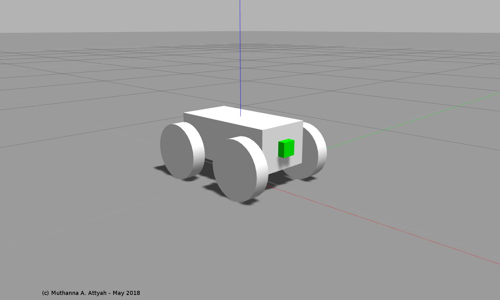
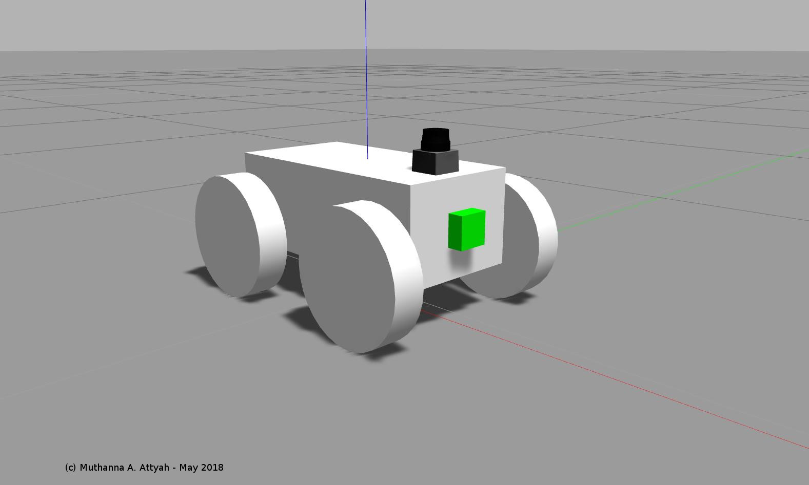

# RoboND Robot Localization Project
## using AMCL ROS Package
## (c) Muthanna A. Attyah 
## May 2018


## Creating a new ROS package from scratch
If you would like to create the simulated robot package from scratch please see steps on th following file:
[udacity_bot package creation steps](udacity_bot_creation_steps.md)

## Repository installation steps:

* Clone from git repository
```bash
$ cd ~
$ git clone https://github.com/mkhuthir/RoboND_Robot_Localization_Project.git catkin_ws
```

* Install the following packages if it is not yet installed:

```bash
$ sudo apt-get install ros-kinetic-navigation
$ sudo apt-get install ros-kinetic-map-server
$ sudo apt-get install ros-kinetic-move-base
$ rospack profile
$ sudo apt-get install ros-kinetic-amcl
```

* Compile code using `catkin_make` and source it.

```bash
$ cd catkin_ws
$ catkin_make
$ source ~/catkin_ws/devel/setup.bash
```

## Launching udacity_bot Packages

* if you want to launch empty world with only the robot use the following:

```bash
$ roslaunch udacity_bot udacity_empty_world.launch
```
* to launch the simulated robot along with amcl package in jackal race world, run the following commands each in a separate terminal window.

To launch jackal race world

```bash
$ roslaunch udacity_bot udacity_world.launch
```
To start amcl node

```bash
$ roslaunch udacity_bot amcl.launch
```
To send 2d navigation goal

```bash
$ rosrun udacity_bot navigation_goal
```
## udacity_bot creation steps

### Robot chassis with casters:

<p align="center">  </p>

### Robot chassis with wheels:

<p align="center">  </p>

### Robot chassis + wheels + camera sensor:

<p align="center">  </p>

### Robot chassis + wheels + camera sensor + laser finder sensor:

<p align="center">  </p>

### Full robot model with material colors in RViz:

<p align="center">  </p>

### Robot after reaching goal in jackal race world.

<p align="center">  </p>

### Test video

[](http://www.youtube.com/watch?v=lxxqGsvKArw)

## Launching muth_bot Packages

* if you want to launch empty world with only the robot use the following:

```bash
$ roslaunch muth_bot muth_empty_world.launch
```
* to launch the simulated robot along with amcl package in jackal race world, run the following commands each in a separate terminal window.

To launch jackal race world

```bash
$ roslaunch muth_bot muth_world.launch
```
To start amcl node

```bash
$ roslaunch muth_bot amcl.launch
```
To send 2d navigation goal

```bash
$ rosrun muth_bot goto_goal
```

## muth_bot creation steps

To create this bot package from scatch you can follow same steps as explained above with some differences in gazebo plugins and config files.

### Robot chassis:

<p align="center">  </p>

### Robot chassis with wheels:

<p align="center">  </p>

### Robot chassis + wheels + camera sensor:

<p align="center">  </p>

### Robot chassis + wheels + camera sensor + laser finder sensor:

<p align="center">  </p>

### Full robot model with material colors in RViz:

<p align="center">  </p>

### Robot after reaching goal in jackal race world.

<p align="center">  </p>

### Test video

[](http://www.youtube.com/watch?v=ODnIm-24Zgw)
