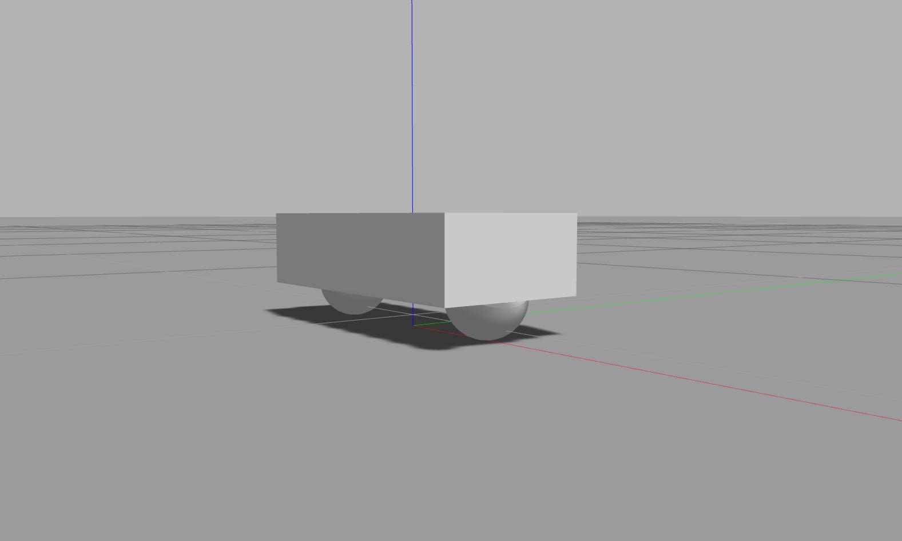
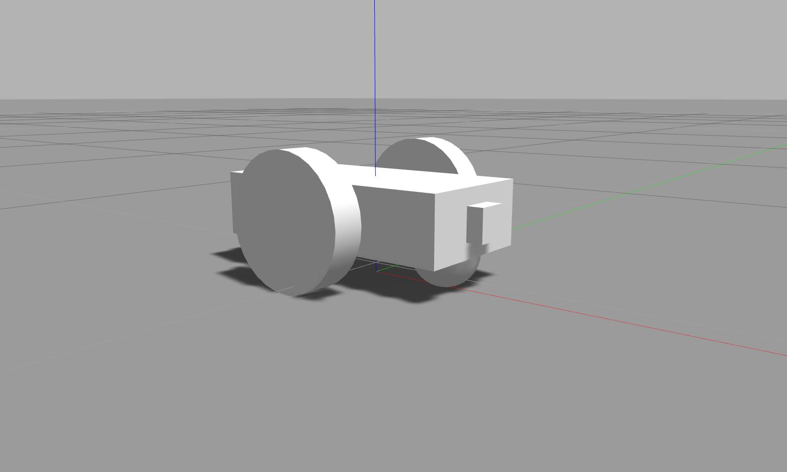

# RoboND_Robot_Localization_Project
ROS Robot Localization Using AMCL ROS Package


## Installation of Some Required ROS packages:

Install the following packages if it is not yet installed:

```bash
$ sudo apt-get install ros-kinetic-navigation
$ sudo apt-get install ros-kinetic-map-server
$ sudo apt-get install ros-kinetic-move-base
$ rospack profile
$ sudo apt-get install ros-kinetic-amcl
```

## Creating Package:

Create new empty package:

```bash
$ cd ~/catkin_ws/src/
$ catkin_create_pkg udacity_bot
```

Create folders, **launch** and **worlds**, that will further define the structure of your package:

```bash
$ cd udacity_bot
$ mkdir launch
$ mkdir worlds
```

 create a simple world, with no objects or models that will be launched later in Gazebo
 
 ```bash
$ cd worlds
$ nano udacity.world
```

```xml
<?xml version="1.0" ?>

<sdf version="1.4">

  <world name="default">

    <include>
      <uri>model://ground_plane</uri>
    </include>

    <!-- Light source -->
    <include>
      <uri>model://sun</uri>
    </include>

    <!-- World camera -->
    <gui fullscreen='0'>
      <camera name='world_camera'>
        <pose>4.927360 -4.376610 3.740080 0.000000 0.275643 2.356190</pose>
        <view_controller>orbit</view_controller>
      </camera>
    </gui>

  </world>
</sdf>
```

create a launch file:

```bash
$ cd ..
$ cd launch
$ nano udacity_world.launch
```

```xml
<?xml version="1.0" encoding="UTF-8"?>

<launch>

  <arg name="world" default="empty"/> 
  <arg name="paused" default="false"/>
  <arg name="use_sim_time" default="true"/>
  <arg name="gui" default="true"/>
  <arg name="headless" default="false"/>
  <arg name="debug" default="false"/>

  <include file="$(find gazebo_ros)/launch/empty_world.launch">
    <arg name="world_name" value="$(find udacity_bot)/worlds/udacity.world"/>
    <arg name="paused" value="$(arg paused)"/>
    <arg name="use_sim_time" value="$(arg use_sim_time)"/>
    <arg name="gui" value="$(arg gui)"/>
    <arg name="headless" value="$(arg headless)"/>
    <arg name="debug" value="$(arg debug)"/>
  </include>

</launch>
```

Launch it!

```bash
$ cd ~/catkin_ws/
$ catkin_make
$ source devel/setup.bash
$ roslaunch udacity_bot udacity_world.launch
```

<p align="center">  </p>

## Build a very basic mobile robot model

create a new folder in your package directory and an empty xacro file for the robot's URDF description:

```bash
$ cd ~/catkin_ws/src/udacity_bot/
$ mkdir urdf
$ cd urdf
$ nano udacity_bot.xacro
```

```xml
<?xml version='1.0'?>

<robot name="udacity_bot" xmlns:xacro="http://www.ros.org/wiki/xacro">

  <link name="robot_footprint"></link>

  <joint name="robot_footprint_joint" type="fixed">
    <origin xyz="0 0 0" rpy="0 0 0" />
    <parent link="robot_footprint"/>
    <child link="chassis" />
  </joint>

  <link name='chassis'>
    <pose>0 0 0.1 0 0 0</pose>

    <inertial>
      <mass value="15.0"/>
      <origin xyz="0.0 0 0" rpy=" 0 0 0"/>
      <inertia
          ixx="0.1" ixy="0" ixz="0"
          iyy="0.1" iyz="0"
          izz="0.1"
      />
    </inertial>

    <collision name='collision'>
      <origin xyz="0 0 0" rpy=" 0 0 0"/> 
      <geometry>
        <box size=".4 .2 .1"/>
      </geometry>
    </collision>

    <visual name='chassis_visual'>
      <origin xyz="0 0 0" rpy=" 0 0 0"/>
      <geometry>
        <box size=".4 .2 .1"/>
      </geometry>
    </visual>


    <collision name='back_caster_collision'>
      <origin xyz="-0.15 0 -0.05" rpy=" 0 0 0"/>
      <geometry>
        <sphere radius="0.05"/>
      </geometry>
      <surface>
        <friction>
          <ode>
            <mu>0</mu>
            <mu2>0</mu2>
            <slip1>1.0</slip1>
            <slip2>1.0</slip2>
          </ode>
        </friction>
      </surface>
    </collision>

    <visual name='back_caster_visual'>
      <origin xyz="-0.15 0 -0.05" rpy=" 0 0 0"/>
      <geometry>
        <sphere radius="0.05"/>
      </geometry>
    </visual>

    <collision name='front_caster_collision'>
      <origin xyz="0.15 0 -0.05" rpy=" 0 0 0"/>
      <geometry>
        <sphere radius="0.05"/>
      </geometry>
      <surface>
        <friction>
          <ode>
            <mu>0</mu>
            <mu2>0</mu2>
            <slip1>1.0</slip1>
            <slip2>1.0</slip2>
          </ode>
        </friction>
      </surface>
    </collision>

    <visual name='front_caster_visual'>
      <origin xyz="0.15 0 -0.05" rpy=" 0 0 0"/>
      <geometry>
        <sphere radius="0.05"/>
      </geometry>
    </visual>

  </link>

</robot>
```
Create a new launch file that will help load the URDF file

```bash
$ cd ~/catkin_ws/src/udacity_bot/launch/
$ nano robot_description.launch
```

```xml
<?xml version="1.0"?>
<launch>

  <!-- send urdf to param server -->
  <param name="robot_description" command="$(find xacro)/xacro --inorder '$(find udacity_bot)/urdf/udacity_bot.xacro'" />

</launch>
```

update udacity_world.launch so that Gazebo can load that URDF (the robot model)

```bash
$ nano udacity_world.launch
```
Add the following to the launch file (after `<launch>`)

```xml
<include file="$(find udacity_bot)/launch/robot_description.launch"/>
```
Add the following to the launch file (before `</launch>`)

```xml
<!--spawn a robot in gazebo world-->

<node name="urdf_spawner" pkg="gazebo_ros" type="spawn_model" respawn="false" 
output="screen" args="-urdf -param robot_description -model udacity_bot"/>
```
launch everything and check if the robot loads up properly

```bash
$ cd ~/catkin_ws/
$ catkin_make
$ source devel/setup.bash
$ roslaunch udacity_bot udacity_world.launch
```
<p align="center">  </p>


define the left and right robot wheels by adding the following to URDF file:

```xml
<!-- left_wheel -->
 
  <link name="left_wheel">

   <collision name='left_wheel_collision'>
      <origin xyz="0 0 0" rpy=" 0 1.5707 1.5707"/>
      <geometry>
        <cylinder radius="0.1" length="0.05"/>
      </geometry>
      <surface>
        <friction>
          <ode>
            <mu>0</mu>
            <mu2>0</mu2>
            <slip1>1.0</slip1>
            <slip2>1.0</slip2>
          </ode>
        </friction>
      </surface>
    </collision>

    <inertial>
      <mass value="5.0"/>
      <origin xyz="0.0 0 0" rpy=" 0 1.5707 1.5707"/>
      <inertia
          ixx="0.1" ixy="0" ixz="0"
          iyy="0.1" iyz="0"
          izz="0.1"
      />
    </inertial>

    <visual name='left_wheel_visual'>
      <origin xyz="0 0 0" rpy=" 0 1.5707 1.5707"/>
      <geometry>
        <cylinder radius="0.1" length="0.05"/>
      </geometry>
    </visual>

  </link>

  <joint type="continuous" name="left_wheel_hinge">
      <origin xyz="0 0.15 0" rpy="0 0 0"/>
      <child link="left_wheel"/>
      <parent link="chassis"/>
      <axis xyz="0 1 0" rpy="0 0 0"/>
      <limit effort="10000" velocity="1000"/>
      <joint_properties damping="1.0" friction="1.0"/>
  </joint>


  <!-- right_wheel -->
    
 <link name="right_wheel">

   <collision name='right_wheel_collision'>
      <origin xyz="0 0 0" rpy=" 0 1.5707 1.5707"/>
      <geometry>
        <cylinder radius="0.1" length="0.05"/>
      </geometry>
      <surface>
        <friction>
          <ode>
            <mu>0</mu>
            <mu2>0</mu2>
            <slip1>1.0</slip1>
            <slip2>1.0</slip2>
          </ode>
        </friction>
      </surface>
    </collision>

    <inertial>
      <mass value="5.0"/>
      <origin xyz="0.0 0 0" rpy=" 0 1.5707 1.5707"/>
      <inertia
          ixx="0.1" ixy="0" ixz="0"
          iyy="0.1" iyz="0"
          izz="0.1"
      />
    </inertial>

    <visual name='right_wheel_visual'>
      <origin xyz="0 0 0" rpy=" 0 1.5707 1.5707"/>
      <geometry>
        <cylinder radius="0.1" length="0.05"/>
      </geometry>
    </visual>

  </link>

  <joint type="continuous" name="right_wheel_hinge">
      <origin xyz="0 -0.15 0" rpy="0 0 0"/>
      <child link="right_wheel"/>
      <parent link="chassis"/>
      <axis xyz="0 1 0" rpy="0 0 0"/>
      <limit effort="10000" velocity="1000"/>
      <joint_properties damping="1.0" friction="1.0"/>
  </joint>
```

<p align="center">  </p>


## Add Sensors

Add the camera link and a corresponding joint to the end of the URDF file.

```xml
  <!-- camera -->
    
  <link name="camera">

   <collision name='camera_collision'>
      <origin xyz="0 0 0" rpy=" 0 0 0"/>
      <geometry>
        <box size="0.05"/>
      </geometry>
    </collision>

    <inertial>
      <mass value="0.1"/>
      <origin xyz="0 0 0" rpy=" 0 0 0"/>
      <inertia
          ixx="1e-6" ixy="0" ixz="0"
          iyy="1e-6" iyz="0"
          izz="1e-6"
      />
    </inertial>

    <visual name='camera_visual'>
      <origin xyz="0 0 0" rpy=" 0 0 0"/>
      <geometry>
        <box size="0.05 0.05 0.05"/>
      </geometry>
    </visual>

  </link>

  <joint type="fixed" name="camera_joint">
      <origin xyz="0.2 0 0" rpy="0 0 0"/>
      <child link="camera"/>
      <parent link="chassis"/>
      <axis xyz="1 0 0" rpy="0 0 0"/>
  </joint>
```
<p align="center">  </p>


Add hokuyo sensor to your robot model (URDF file) just like the camera sensor.

```xml
  <!-- hokuyo laser range finder -->
    
  <link name="hokuyo">
    <collision name='hokuyo_collision'>
      <origin xyz="0 0 0" rpy=" 0 0 0"/>
      <geometry>
        <box size="0.1 0.1 0.1"/>
      </geometry>
    </collision>

    <inertial>
      <mass value="0.1"/>
      <origin xyz="0 0 0" rpy=" 0 0 0"/>
      <inertia
          ixx="1e-6" ixy="0" ixz="0"
          iyy="1e-6" iyz="0"
          izz="1e-6"
      />
    </inertial>

    <visual name='hokuyo_visual'>
      <origin xyz="0 0 0" rpy=" 0 0 0"/>
      <geometry>
        <mesh filename="package://udacity_bot/meshes/hokuyo.dae"/>
      </geometry>
    </visual>
  </link>

  <joint type="fixed" name="hokuyo_joint">
      <origin xyz="0.15 0 0.1" rpy="0 0 0"/>
      <child link="hokuyo"/>
      <parent link="chassis"/>
      <axis xyz="1 0 0" rpy="0 0 0"/>
  </joint>
```

<p align="center">  </p>

## Add Gazebo Plugins

add the following gazebo plugins by including a gazebo xacro file:

* A plugin for the camera sensor.
* A plugin for the hokuyo sensor.
* A plugin for controlling the wheel joints.

This can be done by adding the following to the top of the file (right before you define the `robot_footprint` link)

```xml
<xacro:include filename="$(find udacity_bot)/urdf/udacity_bot.gazebo" />
```
## Add RViz

Modify robot_description.launch to add the following after the first “param” definition:

```xml
<!-- Send fake joint values-->
  <node name="joint_state_publisher" pkg="joint_state_publisher" type="joint_state_publisher">
    <param name="use_gui" value="false"/>
  </node>

<!-- Send robot states to tf -->
  <node name="robot_state_publisher" pkg="robot_state_publisher" type="robot_state_publisher" respawn="false" output="screen"/>
```

Add the following at the end of the file. After the `urdf_spawner` node definition.

```xml
<!--launch rviz-->
<node name="rviz" pkg="rviz" type="rviz" respawn="false"/>
```

Launch it!

```bash
$ cd ~/catkin_ws/
$ roslaunch udacity_bot udacity_world.launch
```

This time both Gazebo and RViz should launch up. Once they are loaded -

Select the RViz window, and on the left side, under `Displays`:

Select “**odom**” for fixed frame
Click the “**Add**” button and
* add “**RobotModel**”
* add “**Camera**” and select the Image topic that was defined in the camera gazebo plugin
* add “**LaserScan**” and select the topic that was defined in the hokuyo gazebo plugin.

Your robot model should load up in RViz.

In Gazebo, click on “**Insert**” and from the list add any item in the world in front of the robot. You should be able to see the item in Rviz in the “Camera” viewer, and the Laser scan of that object as well.

<p align="center">  </p>

